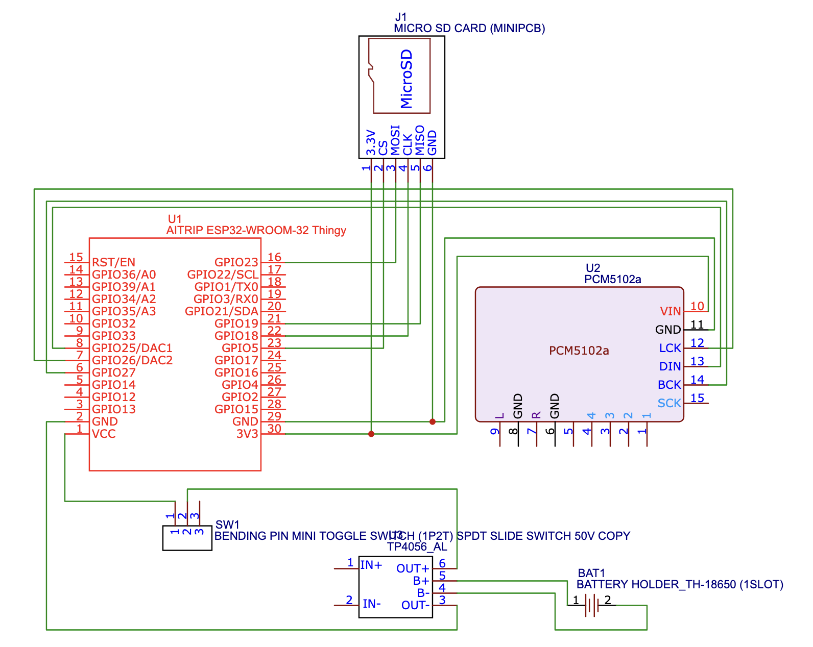
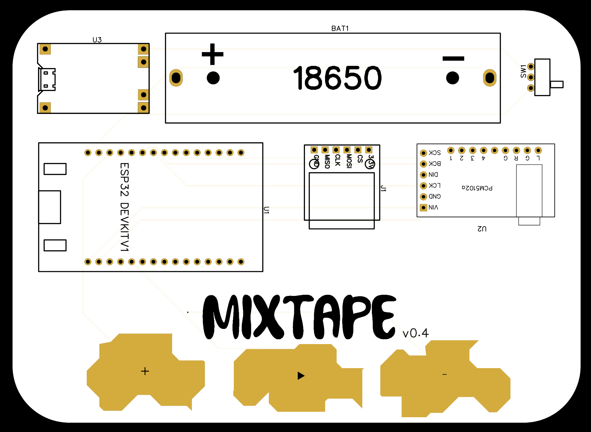
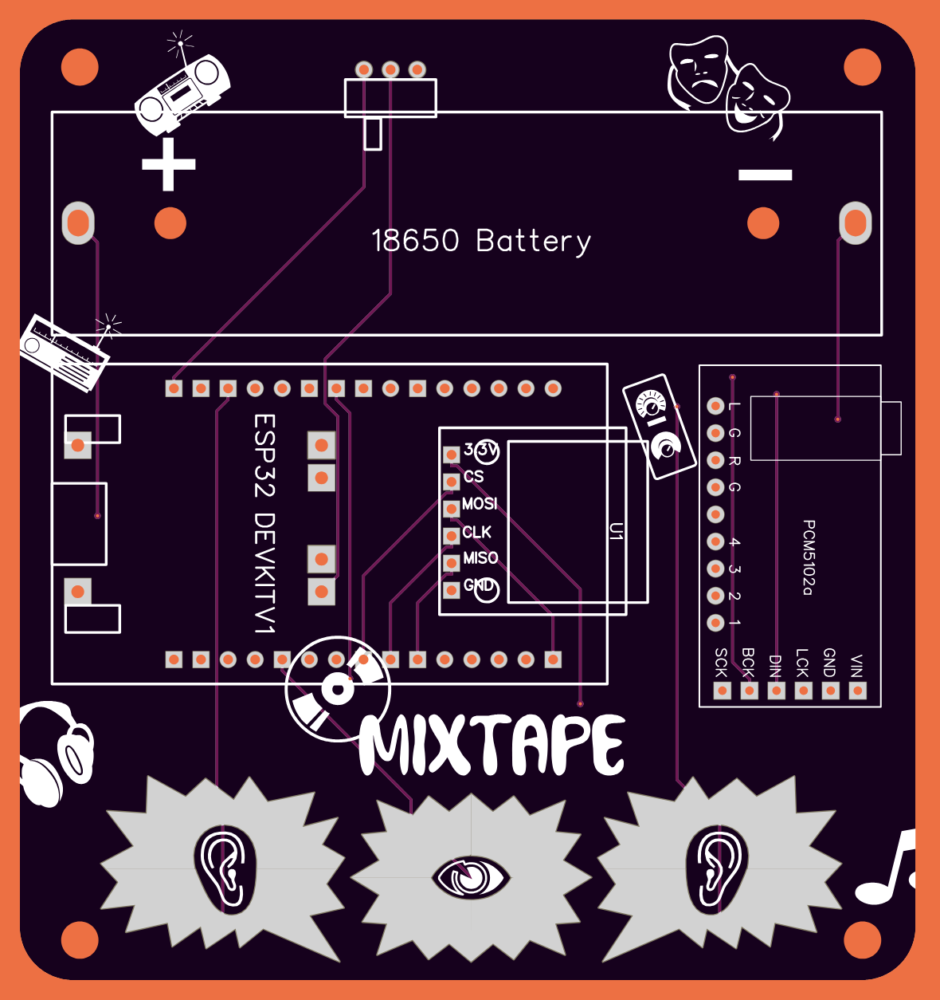

# mixtape
A Neo-retro take on a mixtape. 

Want to make a mixtape, but deeply dissatisfied with the lack of physicality and materiality of a digital playlist on Apple Music or Spotify? Do you find yourself missing a walkman or an iPod? Crave big buttons and the Chunk? Well, you've come to the right place! or some version of it, at the very least. This is my attempt at creating a physical device which brings back some of the umami of a mixtape. 

This mixtape uses a ESP32, a SD Card Reader, a DAC decoder, a battery + battery power manager. The battery is optional, but it's a nice to have. Ideally, I'd love to use lower level components (DFPlayer Pro with a 128MB of storage is a great starting point), but this setup is a good balance of price, component availability, and ease of use. The ESP32 is a great platform, allows the possibility to build additional features in the future. 

## Physical Setup
- ESP-WROOM-32 dev board (30 pin)
- PCM5102A (add a drop of solder to close the SCK bridge / or connect the SCK pin to ground)
- Micro-SD Card Reader
- TP4056
- 18650 Cell

Here's the wiring diagram which shows how everything is connected:

This wiring works well on a breadboard, but any loose connections will cause noisy audio playback, or no playback at all. Use a proto-board, and solder all the components for a better experience. The 18650 cell and TP4056 are optional, power can be supplied via the ESP32.

Better yet, use a custom PCB to layout the components neatly and avoid the mess of wires needed to make the proto-board setup work. The PCB also has 3 touch pads which take advantge of the ESP32's touch pins to control the playback.

 Here's the first iteration of a PCB board I designed. All components are laid out on top, which makes a for a large PCB.

In the second iteration, the components are attached to the front and back of the device, a far more compact design. It also has provisions for M3 mounting holes.

I'll eventually upload the PCB design files + Gerber to this repository (/src/hardware) if you'd like to order your own. 

## Software

The mixtape uses C++ code, using the Arduino IDE to speak with the ESP32. Make sure you install the appropriate libraries to help Arduino IDE communicate with the ESP32, and have the right boards installed in the board manager.

This project uses the following libraries:
- [ESP8266Audio](https://github.com/earlephilhower/ESP8266Audio/tree/master)
- Pre-installed Arduino, SD, and FS libraries

Use the Arduino project titled 'mixtape_v1.0' in the /src/software folder.

Format your micro-SD card to FAT32 using the official SD card formatting software, or your own system disk utility, and store all your music files in a folder titled 'music' as .mp3 files (44.1 Khz, Stereo files). You can change this in the code if you'd like.

## Future Development

Feel free to use the design and code as you see fit, this project is licensed under Creative Commons Zero. Any feedback, iterations or developments are welcome!